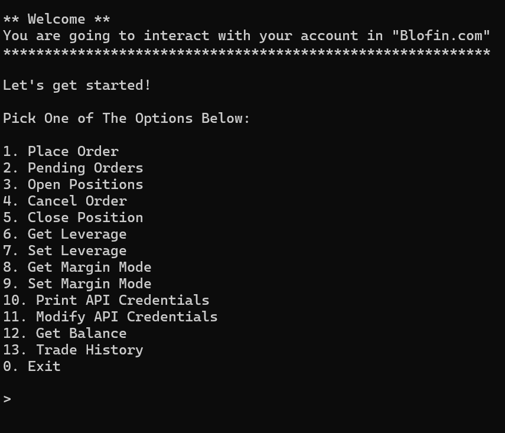

## Interact With Your Account Via Terminal

### This script only works with [Blofin Exchange](https://blofin.com)
#### Use this script and you don't have to login to your account everytime!

1. Prerequisites:
    - Creat your API Keys here: [Blofin](https://blofin.com/account/apis)
    - Install [Python](https://www.python.org/downloads/)
    - Open Terminal and Install ``dotenv`` package:<br><br>
        ```
          pip install python-dotenv
          pip install requests
        ```
2. Download The Repo:

    ```
      git clone https://github.com/nitecity/blofin-cli
      cd blofin-cli
    ```

3. Run the script:
    <p>Windows</p>

   ```
       py main.py
   ```
   <p>Mac and Linux</p>

   ```
       python3 main.py
   ```

4. After storing your API Keys, You'll see these options:

    

5. Let's place a limit order

    
