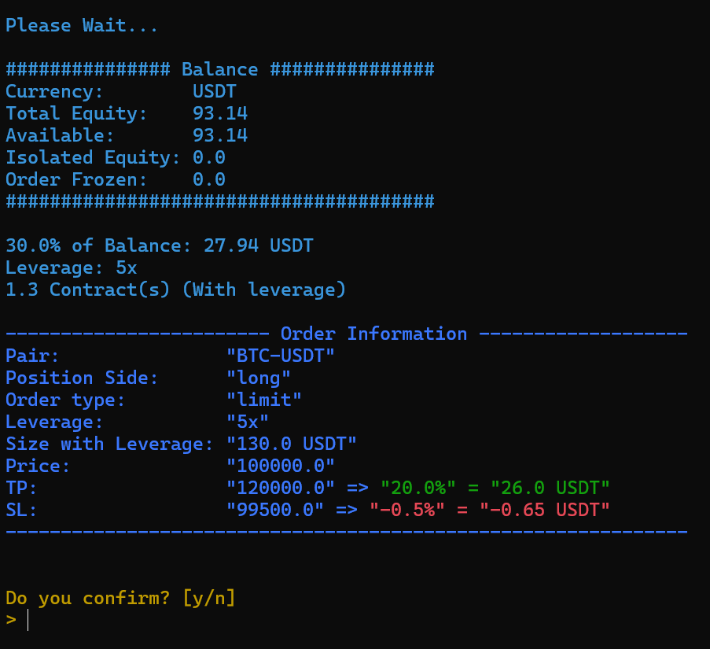

## Interact With Your Trading Account Via Terminal

### This script only works with [Blofin Exchange](https://blofin.com)

1. Prerequisites:
    - Creat your API Keys here: [Blofin](https://blofin.com/account/apis)
    - Install [Python](https://www.python.org/downloads/)
    - Open Terminal and Install required packages:
    <br/>
        ```bash
          pip install python-dotenv
          pip install requests
          pip install colorama
        ```
2. Download The Repo:

    ```
      git clone https://github.com/nitecity/blofin-cli
      cd blofin-cli
    ```

3. Run the script:
    <p>Windows</p>

   ```
       py main.py
   ```
   <p>Mac and Linux</p>

   ```
       python3 main.py
   ```

4. The script asks you to provide your API credentials, then stores in ``.env`` (only once):
    
    

5. After storing your ``API Keys``, You'll see the options:

    

6. Let's place a limit order
    <p><i>Look at the inputs</i></p>
    
    

<p><i>TP-SL calculation is approximate</i></p>
